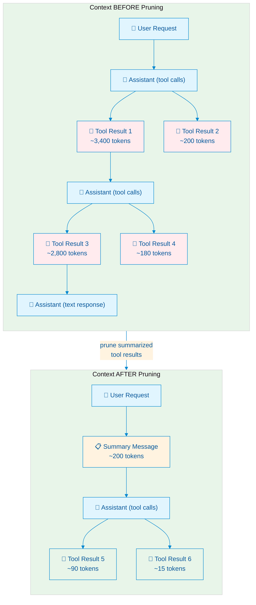
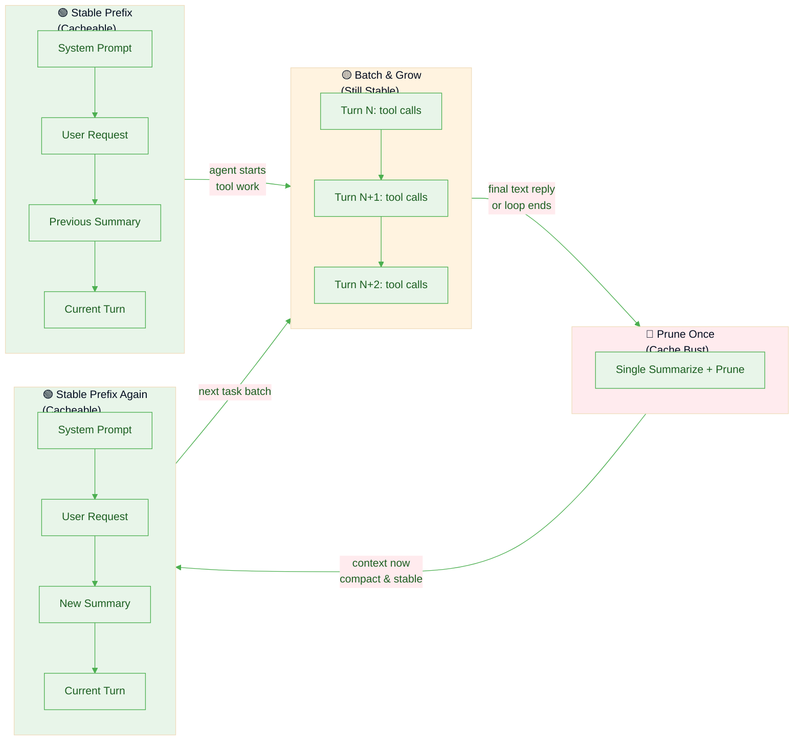

# Understanding Context Pruning in Pi

> How `pi-context-prune` compresses tool-call history, why it matters for long-running sessions, and how it balances context size against provider-side prefix caching.

---

## Table of Contents

1. [What Does a Long Session Look Like?](#what-does-a-long-session-look-like)
2. [What Pruning Does](#what-pruning-does)
3. [Pruned Data Is Still Available](#pruned-data-is-still-available)
4. [What Actually Lives in the Pruner Index](#what-actually-lives-in-the-pruner-index)
5. [How the Model Re-reads Raw Outputs](#how-the-model-re-reads-raw-outputs)
6. [How Prefix Caching Works](#how-prefix-caching-works)
7. [Why Frequent Pruning Busts Cache](#why-frequent-pruning-busts-cache)
8. [The Sweet Spot: Batch and Prune](#the-sweet-spot-batch-and-prune)
9. [Advanced Features & Safeguards](#advanced-features--safeguards)
10. [Why Summarization Works: Research Evidence](#why-summarization-works-research-evidence)
   - [SUPO — Summarization augmented Policy Optimization](#supo--summarization-augmented-policy-optimization)
   - [ReSum — Recursive Summarization for Long-Horizon Agents](#resum--recursive-summarization-for-long-horizon-agents)
   - [ACON — Agent Context Optimization](#acon--agent-context-optimization)
11. [Summary](#summary)

---

## What Does a Long Session Look Like?

In Pi, every assistant turn that calls tools produces a sequence of messages in the context tree. In a long coding or research session, this accumulates rapidly:

### ASCII: A typical Pi context tree (before pruning)

```
┌─────────────────────────────────────────────────────────────────────────┐
│  SESSION CONTEXT (growing without bound)                                │
├─────────────────────────────────────────────────────────────────────────┤
│                                                                         │
│  [system]     You are Pi, a helpful coding assistant...                 │
│                                                                         │
│  [user]       Build a React component that fetches data from            │
│               an API and displays it in a table...                      │
│                                                                         │
│  ── Turn 1 ─────────────────────────────────────────                    │
│  [assistant]  <tool_call name="read_file" id="tc-001">                  │
│                 {"path": "src/App.tsx"}                                 │
│  [tool]       export default function App() { ... }        ← 45 tokens  │
│                                                                         │
│  ── Turn 2 ─────────────────────────────────────────                    │
│  [assistant]  <tool_call name="read_file" id="tc-002">                  │
│                 {"path": "package.json"}                                │
│  [tool]       { "dependencies": { "react": "^18.2.0", ... }  ← 120 tok  │
│                                                                         │
│  ── Turn 3 ─────────────────────────────────────────                    │
│  [assistant]  <tool_call name="web_search" id="tc-003">                 │
│               <tool_call name="read_file" id="tc-004">                  │
│  [tool-003]   React Table v7 docs, TanStack Table API...   ← 3,400 tok  │
│  [tool-004]   import { useState } from 'react'; ...        ← 200 tokens │
│                                                                         │
│  ── Turn 4 ─────────────────────────────────────────                    │
│  [assistant]  <tool_call name="edit_file" id="tc-005">                  │
│  [tool]       ✔︎  File updated successfully                 ← 15 tokens  │
│                                                                         │
│  ── Turn 5 ─────────────────────────────────────────                    │
│  [assistant]  <tool_call name="bash" id="tc-006">                       │
│               <tool_call name="read_file" id="tc-007">                  │
│  [tool-006]   BUILD OUTPUT (npm run build):                ← 2,800 tok  │
│               [warn] Circular dependency detected...                    │
│               [warn] Chunk size exceeds 500kb...                        │
│               [error] TypeScript compilation failed...                  │
│  [tool-007]   Updated file contents...                     ← 180 tokens │
│                                                                         │
│  ── Turn 6 ── ... (more turns, more tool calls) ──                      │
│                                                                         │
│  ═══════════════════════════════════════════════════════                │
│  Context size: ~15,000 tokens and growing...                            │
│  Most tokens are raw tool outputs the model already "consumed"          │
│  ═══════════════════════════════════════════════════════                │
│                                                                         │
└─────────────────────────────────────────────────────────────────────────┘
```

In a long session this can grow to **30k–100k+ tokens**. The model pays for every token on every subsequent request. More importantly, the "signal" (what the model actually needs to know) is buried in a mountain of "noise" (full build logs, search results, file contents it already processed).

---

## What Pruning Does

`pi-context-prune` intercepts completed tool-call batches, summarizes them, and replaces the raw outputs with compact summaries in future context. The original data is archived in the session index.

### ASCII: The same session *after* pruning Turns 1–5

```
┌─────────────────────────────────────────────────────────────────────────┐
│  SESSION CONTEXT (after pruning Turns 1-5)                              │
├─────────────────────────────────────────────────────────────────────────┤
│                                                                         │
│  [system]     You are Pi, a helpful coding assistant...                 │
│                                                                         │
│  [user]       Build a React component that fetches data from            │
│               an API and displays it in a table...                      │
│                                                                         │
│  [summary]    ╔════════════════════════════════════════════╗            │
│               ║ ⚃  [pruner] Turn 1 summary (5 tools)       ║            │
│               ║                                            ║            │
│               ║ • Read existing App.tsx and package.json   ║            │
│               ║ • Searched React Table docs; decided on    ║            │
│               ║   @tanstack/react-table v8                 ║            │
│               ║ • Created DataTable component with         ║            │
│               ║   sorting, pagination, useQuery hook       ║            │
│               ║ • Build failed: circular dependency in     ║            │
│               ║   utils/index.ts → fix by inlining helpers ║            │
│               ║                                            ║            │
│               ║ Summarized toolCallIds: tc-001..tc-007     ║            │
│               ║ Use context_tree_query to retrieve original║            │
│               ╚════════════════════════════════════════════╝            │
│               ← ~200 tokens (was ~6,760 tokens)                         │
│                                                                         │
│  ── Turn 6 ─────────────────────────────────────────                    │
│  [assistant]  <tool_call name="read_file" id="tc-008">                  │
│               <tool_call name="edit_file" id="tc-009">                  │
│  [tool-008]   import { helperA } from './helpers'; ...     ← 90 tokens  │
│  [tool-009]   ✔︎  File updated successfully                 ← 15 tokens  │
│                                                                         │
│  ═══════════════════════════════════════════════════════                │
│  Context size: ~500 tokens (plus current turn)                          │
│  ~96% reduction in "stale" context tokens                               │
│  ═══════════════════════════════════════════════════════                │
│                                                                         │
└─────────────────────────────────────────────────────────────────────────┘
```

### Mermaid: The pruning transformation



**Key points:**

- The `AssistantMessage` tool-call blocks are **kept** (they carry `toolCallId`s the model may reference later)
- Only `ToolResultMessage` entries are **removed** from future context
- Every pruned tool call is also copied into the pruner's runtime/session index with its `toolCallId`, tool name, args, status, turn index, timestamp, and full `resultText`
- A summary message is injected as a "steer" (guaranteed to land before the next LLM call)
- The session file retains the original history, and the pruner keeps an index of summarized tool outputs — pruning affects only what the *next* request sees in active context

---

## Pruned Data Is Still Available

Pruning does **not** delete data. It moves raw tool results out of the hot path (active LLM context) and into an indexed archive the model can query later.

There are two separate things happening during pruning:

1. **Context filtering:** future requests stop including the old `toolResult` messages.
2. **Index preservation:** the extension stores each summarized tool call in the pruner index, keyed by `toolCallId`.

That distinction is the core idea:

- **Pruned from context** does **not** mean **lost**
- It means **hidden from the default prompt**, but still **recoverable on demand**

### ASCII: How `context_tree_query` recovers pruned data

```
┌─────────────────────────────────────────────────────────────────────────┐
│  RECOVERING PRUNED DATA via context_tree_query                          │
├─────────────────────────────────────────────────────────────────────────┤
│                                                                         │
│  [summary]  ... build failed: circular dependency ...                   │
│             Summarized toolCallIds: `tc-006`                            │
│             Use context_tree_query to retrieve originals                │
│                                                                         │
│  ── LLM calls context_tree_query({ toolCallIds: ["tc-006"] }) ──        │
│                                                                         │
│  [tool]     ⌕  context_tree_query result                                │
│             ┌─────────────────────────────────────────────────────┐     │
│             │  Tool: bash (tc-006)                                │     │
│             │  Status: done                                       │     │
│             │  ─────────────────────────────────────────────────  │     │
│             │  $ npm run build                                    │     │
│             │  > react-app@0.1.0 build                            │     │
│             │  > tsc && vite build                                │     │
│             │                                                     │     │
│             │  [warn] Circular dependency: src/utils/index.ts ->  │     │
│             │         src/utils/helpers.ts -> src/utils/index.ts  │     │
│             │  [warn] (!) Some chunks are larger than 500 kBs     │     │
│             │  [error] TS2345: Argument of type 'X' not assignable│     │
│             │          to parameter of type 'Y'...                │     │
│             │                                                     │     │
│             │  (truncated to 8,000 bytes / 200 lines)             │     │
│             └─────────────────────────────────────────────────────┘     │
│                                                                         │
│  The LLM now has the full build log back in context, on demand,         │
│  without permanently inflating the context window.                      │
│                                                                         │
└─────────────────────────────────────────────────────────────────────────┘
```

## What Actually Lives in the Pruner Index

When a batch is summarized, the extension writes a record for each tool call into `ToolCallIndexer` and persists that record into the session as a custom index entry.

Conceptually, each indexed record looks like this:

```ts
{
  toolCallId: "tc-006",
  toolName: "bash",
  args: { command: "npm run build" },
  resultText: "full original raw output...",
  isError: false,
  turnIndex: 5,
  timestamp: "2026-04-21T12:34:56.000Z"
}
```

This matters because the summary is **not** the only surviving representation of the old tool call.
The model still has access to:

- the original `toolCallId`
- the tool name and arguments
- whether the tool errored
- which turn it came from
- the full original raw result text

So after pruning, the model is working with a **two-layer memory**:

1. **Hot memory:** compact summary text kept directly in context
2. **Cold memory:** full raw tool outputs stored in the pruner index and retrievable by ID

### What is removed vs what is preserved

| Part of old turn | After pruning | Why |
|---|---|---|
| Assistant tool-call block | **Kept in context** | Preserves the `toolCallId` anchors the model can reference |
| Tool result message | **Removed from active context** | Saves tokens (unless the summary is larger than the raw text, in which case pruning is skipped) |
| Summary message | **Added to context** | Gives the model a compact description of what happened |
| Indexed tool-call record | **Stored in pruner index** | Lets the model re-open the original raw output later |

## How the Model Re-reads Raw Outputs

The intended recovery flow is:

1. The model reads a summary message.
2. The summary lists the `toolCallId`s that were summarized.
3. The model decides the summary is not enough and wants exact raw output.
4. The model calls `context_tree_query({ toolCallIds: [...] })`.
5. The tool looks up those IDs in the pruner index.
6. The tool returns the original stored output back into the current turn.
7. The model can now inspect that raw result and continue reasoning.

### ASCII: end-to-end "prune, then re-read" flow

```text
assistant turn with tools
        │
        ▼
raw tool results exist in context
        │
        ▼
batch gets summarized
        │
        ├─► summary message added to context
        │      └─► includes summarized toolCallIds
        │
        ├─► tool results indexed by toolCallId
        │      └─► full raw resultText stored in index/session
        │
        └─► old toolResult messages removed from future context

later...
        │
        ▼
model sees summary and decides: "I need the exact old output"
        │
        ▼
context_tree_query({ toolCallIds: ["tc-006"] })
        │
        ▼
query tool loads indexed record for tc-006
        │
        ▼
original raw output is returned into the current turn
        │
        ▼
model continues with exact old context back in view
```

### Why this is important

This is what makes pruning safe for real agent work:

- summaries keep the default context small
- `toolCallId`s keep old work addressable
- `context_tree_query` makes the archive readable again
- the model can "page in" exact old context only when it actually needs it

So the extension is **not asking the model to trust summaries forever**. It is asking the model to use summaries as the default view, while keeping a precise escape hatch back to the original raw data.

---

## How Prefix Caching Works

Modern LLM API providers (Anthropic, OpenAI, vLLM, etc.) implement **prefix caching** (also called "prompt caching") to speed up repeated requests with similar prompts.

### How it works

LLM inference has two phases:

1. **Prefill** — compute Key-Value (KV) attention states for all input tokens
2. **Decode** — generate output tokens autoregressively, reusing the cached KV states

Prefix caching stores the KV states for an exact token sequence on the provider's GPU. When a new request shares an identical prefix, the provider **skips prefill** for that prefix and starts from the cached KV state.

### ASCII: Cache hit vs cache miss

```
┌─────────────────────────────────────────────────────────────────────────┐
│                    WITHOUT PREFIX CACHING                               │
├─────────────────────────────────────────────────────────────────────────┤
│                                                                         │
│  Request 1:  [System] [User Q1] ──► LLM computes KV for ALL tokens      │
│                                        │                                │
│                                        ▼                                │
│                                   Generate answer                       │
│                                                                         │
│  Request 2:  [System] [User Q2] ──► LLM computes KV for ALL tokens      │
│              ▲▲▲▲▲▲▲▲▲▲▲▲▲▲▲▲▲         │ (EVERYTHING recomputed)        │
│              Same prefix as Request 1  ▼                               │
│                                   Generate answer                       │
│                                                                         │
│  Time:  ████████████████████████████████████████  ~2.5s each            │
│  Cost:  Full input tokens priced at standard rate                       │
│                                                                         │
└─────────────────────────────────────────────────────────────────────────┘

┌─────────────────────────────────────────────────────────────────────────┐
│                    WITH PREFIX CACHING (HIT)                            │
├─────────────────────────────────────────────────────────────────────────┤
│                                                                         │
│  Request 1:  [System] [User Q1] ──► LLM computes KV for ALL tokens      │
│                                        │                                │
│                    ┌───────────────────┘                                │
│                    ▼                                                    │
│              [STORED IN CACHE]                                          │
│                                                                         │
│  Request 2:  [System] [User Q2] ──► SKIP! KV loaded from cache          │
│              ▲▲▲▲▲▲▲▲▲▲▲▲▲▲▲▲▲         │ (prefix match = instant)       │
│              Cache hit!                ▼                                │
│                                   Only compute NEW tokens               │
│                                   Generate answer                       │
│                                                                         │
│  Time:  ████████████████████░░░░░░░░░░░░░░░░░░░  ~0.5s (80% faster)     │
│  Cost:  Cached prefix at 50-90% discount (provider-dependent)           │
│                                                                         │
└─────────────────────────────────────────────────────────────────────────┘
```

### Provider specifics

| Provider | Cache Activation | Match Type | Duration |
|---|---|---|---|
| **Anthropic** | Manual — `cache_control: {type: "ephemeral"}` on message blocks | Exact prefix from breakpoints | Tied to usage pattern |
| **OpenAI** | Automatic for prompts ≥1,024 tokens | Exact prefix match; ~first 256 tokens hashed for routing | 5–10 min inactivity (up to 1 hr) |
| **vLLM / Self-hosted** | Automatic via hash-based block matching | Exact block match | Instance lifetime |

### Critical rule

> **Cache matching requires *exact* token sequences.** Any change — reordering messages, editing text, adding/removing tool results, even whitespace — alters the prefix hash and triggers a **cache miss**.

---

## Why Frequent Pruning Busts Cache

Every time you prune, you **rewrite the prefix**. The message that was previously a 3,400-token tool result is now a 200-token summary. That's a different token sequence, so the cache is invalidated.

### ASCII: The per-turn pruning trap (`every-turn` mode)

```
┌─────────────────────────────────────────────────────────────────────────┐
│  every-turn MODE — AGGRESSIVE BUT CACHE-UNFRIENDLY                      │
├─────────────────────────────────────────────────────────────────────────┤
│                                                                         │
│  Turn 1:  Read file → 45 tokens                                         │
│           └──► summarize → inject summary                               │
│           │                                                             │
│           └──► CACHE BUST: context changed from [toolResult] to [sum]   │
│                                                                         │
│  Turn 2:  Read package.json → 120 tokens                                │
│           └──► summarize → inject summary                               │
│           │                                                             │
│           └──► CACHE BUST again: prefix rewritten AGAIN                 │
│                                                                         │
│  Turn 3:  Web search + read file → 3,600 tokens                         │
│           └──► summarize → inject summary                               │
│           │                                                             │
│           └──► CACHE BUST again: prefix rewritten AGAIN                 │
│                                                                         │
│  After 5 turns:                                                         │
│    • 5 summarizer LLM calls (latency + cost)                            │
│    • 5 cache busts (FULL prefill every time)                            │
│    • No prefix ever stayed stable long enough to benefit from caching   │
│                                                                         │
│  Time:  ████████████████░░░░░░  ~80% spent on re-computing prefixes     │
│                                                                         │
└─────────────────────────────────────────────────────────────────────────┘
```

---

## The Sweet Spot: Batch and Prune

The insight is simple: **batch many tool turns, then prune once**. Everything before the prune point stays in the prefix cache and remains cacheable. Only the new suffix (since the last prune) needs fresh computation.

### ASCII: Batch pruning (`agent-message` mode)

```
┌─────────────────────────────────────────────────────────────────────────┐
│  agent-message MODE — BATCH THEN PRUNE (RECOMMENDED)                    │
├─────────────────────────────────────────────────────────────────────────┤
│                                                                         │
│  ┌─────────────────────────────────────────────────────────────────┐    │
│  │  BATCH PHASE: Tool turns accumulate (not pruned yet)            │    │
│  │                                                                 │    │
│  │  Turn 1: Read file → 45 tokens   ═══════╗                       │    │
│  │  Turn 2: Read package → 120 tokens  ════╬══════╗                │    │
│  │  Turn 3: Web search + read → 3,600 tok  ═════╬═╬═════╗          │    │
│  │  Turn 4: Edit file → 15 tokens    ═══════╬═╬═╬═╬════╬═════╗     │    │
│  │  Turn 5: Build + read → 2,980 tokens    ═╬═╬═╬═╬════╬═════╬═╗   │    │
│  │  Turn 6: Read + edit → 105 tokens   ═════╬═╬═╬═╬════╬═════╬═╬   │    │
│  │                                       ▼ ▼ ▼ ▼   ▼     ▼   ▼ ▼   │    │
│  │  All these tool results stay in context UNCHANGED               │    │
│  │  → Prefix cache is STABLE → cache HITS on every turn            │    │
│  └─────────────────────────────────────────────────────────────────┘    │
│                                    │                                    │
│                                    │ Agent sends final text reply       │
│                                    ▼                                    │
│  ┌─────────────────────────────────────────────────────────────────┐    │
│  │  PRUNE PHASE: Single summary replaces batch                     │    │
│  │                                                                 │    │
│  │  [summary] "Built React table component. Key decisions:..."     │    │
│  │                                                                 │    │
│  │  ONE cache bust, then context is STABLE again                   │    │
│  └─────────────────────────────────────────────────────────────────┘    │
│                                    │                                    │
│  ┌─────────────────────────────────────────────────────────────────┐    │
│  │  STABLE PHASE: New requests reuse cached prefix                 │    │
│  │                                                                 │    │
│  │  User: "Now add sorting"                                        │    │
│  │  → Cache HIT on [system] + [user] + [summary] prefix            │    │
│  │  → Only "Now add sorting" needs prefill                         │    │
│  │  → Fast + cheap                                                 │    │
│  └─────────────────────────────────────────────────────────────────┘    │
│                                                                         │
│  Result: 1 cache bust per meaningful work unit, not per turn            │
│                                                                         │
└─────────────────────────────────────────────────────────────────────────┘
```

### Mermaid: Cache-friendly pruning lifecycle



### Cache impact trade-off

| Mode | Cache Busts per 5 Turns | Context Reclaimed | Recommended for |
|---|---|---|---|
| `every-turn` | 5 | Immediate | Debugging only |
| `agent-message` | 1 | After batch | **Default** — best balance |
| `on-context-tag` | ~1–2 | At milestones | Save-point workflows |
| `on-demand` | 0–1 | When you say so | Maximum cache preservation |

> **Everything before the previous pruning point stays in the prefix cache.** The cached prefix is the stable foundation; only the new suffix (recent turns since last prune) changes per request.

---

## Advanced Features & Safeguards

The `pi-context-prune` extension includes several mechanisms to ensure pruning is safe, transparent, and configurable:

- **Oversized Summary Skipping (`skip-oversized`):** Occasionally, a batch of tool calls produces very little raw text, and the LLM's summary ends up being *larger* than the original content. When this happens, the pruner detects it and automatically skips pruning that batch. The frontier advances, but the original raw text remains in context to save tokens.
- **Tree Browser (`/pruner tree`):** You can visually explore all pruned tool calls in your current session using an interactive, foldable tree UI. Selecting a summary lets you inspect its contents directly.
- **Agentic-Auto Unpruned Count Reminder (`remindUnprunedCount`):** In `agentic-auto` mode, the agent decides when to prune. To help the LLM maintain a healthy cadence, the extension appends a tiny ephemeral `<pruner-note>` to the last tool result before each generation, reminding the model exactly how many unpruned tool calls have piled up in context.
- **Protected Context Tail (`protectedTailTokens`):** You can reserve the newest estimated tokens of the final model-facing context so recent raw tool results stay visible. The estimate uses `js-tiktoken` when available and falls back to a character estimate controlled by `charsPerToken`.
- **Configurable Summarizer Thinking (`summarizerThinking`):** You can control the reasoning effort used during summarization (e.g., `off`, `low`, `high`). This allows you to trade off between summarization speed, cost, and analytical depth.

---

## Why Summarization Works: Research Evidence

Summarizing tool-call history is not just a hack — it is an active research area with strong empirical support. Three recent papers establish the benefits:

---

### SUPO — Summarization augmented Policy Optimization

> **Paper:** *SUPO (arXiv:2510.06727)* — Miao Lu et al.  
> **TL;DR:** RL-trained agents with built-in summarization outperform standard agents on long-horizon tasks while using *less* context.

**Core idea:**
SUPO integrates summarization directly into the RL training pipeline for tool-using agents. Instead of treating context compression as an afterthought, the policy gradient is derived to optimize **both** tool-use behavior **and** summarization strategy end-to-end.

**Method:**
- Periodically compresses tool-using history via LLM-generated summaries
- Retains task-relevant information in compact form
- Derives a policy gradient that lets standard LLM RL infrastructure optimize both behaviors simultaneously
- Enables training beyond fixed context limits

**Key results:**
- Significantly improved success rate on interactive function calling and search tasks
- **Same or lower working context length** compared to baselines that don't summarize
- Test-time scaling: increasing the maximum summarization rounds during evaluation further improves performance

**Why this matters for Pi:**
SUPO proves that summarization is not just about saving tokens — it actively **improves task success** on long-horizon multi-turn problems by preventing context overflow and keeping relevant signals prominent.

---

### ReSum — Recursive Summarization for Long-Horizon Agents

> **Paper:** *ReSum (arXiv:2509.13313)* — Xixi Wu et al. (Alibaba)  
> **TL;DR:** A plug-and-play summarization tool enables web agents to explore indefinitely without hitting context limits, achieving 4.5–12.7% gains over ReAct.

**Core idea:**
ReSum addresses the fundamental conflict between **exploration** (needing many tool calls) and **context limits** (fixed window size). Current agents append every thought/action/observation to history until they crash into the context ceiling.

**Method:**
- Periodically invokes an external **summary tool** to condense interaction history
- The agent restarts reasoning from the compressed summary
- Introduces **ReSum-GRPO**: adapts Group Relative Policy Optimization with **advantage broadcasting** — propagates final trajectory rewards across all segments so early exploration steps get proper credit
- Trained a specialized **ReSumTool-30B** to extract key evidence and propose next steps

**Key results:**
- **4.5% improvement** over ReAct in training-free settings
- **Further 8.2% gain** with ReSum-GRPO training
- A 30B ReSum-enhanced agent with only 1K training samples achieves competitive performance with leading open-source models
- Enables "unbounded exploration" — the agent never hits a hard context wall

**Why this matters for Pi:**
ReSum validates the exact architecture `pi-context-prune` uses: an external summarizer module, periodic compression, and recovery from compressed state. The plug-and-play nature means it works with off-the-shelf agents — no retraining required.

---

### ACON — Agent Context Optimization

> **Paper:** *ACON (arXiv:2510.00615)* — Minki Kang et al. (Microsoft/ KAIST)  
> **TL;DR:** Optimized compression guidelines reduce memory by 26–54% while preserving accuracy; distilled compressors retain >95% of performance.

**Core idea:**
ACON is a unified framework that compresses **both** environment observations and interaction histories into "concise yet informative condensations." It treats compression as an optimization problem: maximize task reward while minimizing context cost.

**Method:**
- **Gradient-free** — uses natural language space optimization (no model fine-tuning)
- **Failure-driven guideline optimization:** runs the agent with and without compression, collects cases where compression caused failure, and uses an optimizer LLM to refine compression guidelines
- Two-step alternation:
  1. **Utility maximization** — ensure task success is preserved
  2. **Compression maximization** — make summaries shorter while keeping sufficiency
- **Distillation:** optimized compressor can be distilled into smaller models (e.g., Qwen-14B) with >95% accuracy retention

**Key results:**
- **26–54% reduction in peak tokens** across AppWorld, OfficeBench, and Multi-objective QA
- Preserves task performance with large models
- **Smaller LMs improve 20–46%** as agents when context compression removes distracting noise
- Distilled compressor retains **>95% accuracy**

**Why this matters for Pi:**
ACON demonstrates that **compression not only saves tokens but can improve agent performance** — especially for smaller models, where long noisy context actively degrades reasoning quality. The failure-driven optimization approach shows that even simple summarization, when guided by task structure, preserves critical signals.

---

## Summary

| Concern | How Pruning Addresses It |
|---|---|
| **Context grows without bound** | Replaces raw tool outputs (~thousands of tokens) with compact summaries (~hundreds) |
| **Signal lost in noise** | Summaries surface the key decisions and facts; raw data is demoted to on-demand query |
| **Cache performance** | Batch-then-prune modes (`agent-message`, `on-context-tag`) minimize cache invalidation |
| **Data availability** | `context_tree_query` recovers full original outputs at any time |
| **Empirical benefit** | SUPO, ReSum, and ACON all show summarization improves or preserves task success while reducing context length 26–54% |

### Choosing a mode

```
┌─────────────────────────────────────────────────────────────────────┐
│                        MODE DECISION TREE                           │
├─────────────────────────────────────────────────────────────────────┤
│                                                                     │
│  "I want to debug summaries"                                        │
│       └──► every-turn                                               │
│                                                                     │
│  "I want maximum control"                                           │
│       └──► on-demand  + /pruner now                                 │
│                                                                     │
│  "I use pi-context / context_tag"                                   │
│       └──► on-context-tag                                           │
│                                                                     │
│  "I want the best balance of automation, savings, and cache hits"   │
│       └──► agent-message  ◄── DEFAULT                               │
│                                                                     │
│  "I'm running long autonomous loops"                                │
│       └──► agentic-auto                                             │
│                                                                     │
└─────────────────────────────────────────────────────────────────────┘
```

### Recommended reading

- Anthropic prompt caching docs: <https://docs.anthropic.com/en/docs/build-with-claude/prompt-caching>
- OpenAI prompt caching docs: <https://platform.openai.com/docs/guides/prompt-caching>
- `pi-context` extension (save-point navigation): <https://github.com/ttttmr/pi-context>
- SUPO: <https://arxiv.org/abs/2510.06727>
- ReSum: <https://arxiv.org/abs/2509.13313>
- ACON: <https://arxiv.org/abs/2510.00615>
